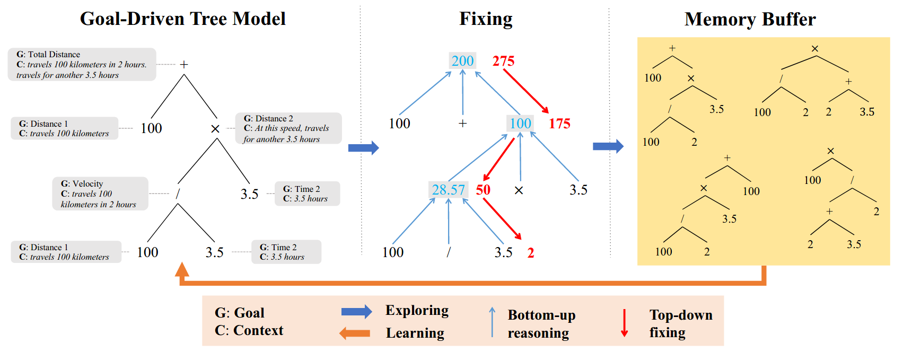

This repository is the implementation for the AAAI2021 accepted paper:
> Yining Hong, Qing Li, Daniel Ciao, Siyuan Huang and Song-Chun Zhu
> [Learning by Fixing: Solving Math Word Problems with Weak Supervision](https://arxiv.org/pdf/2012.10582.pdf)
> AAAI2021. 

## Seq2Tree Model
A [Seq2Tree](https://github.com/ShichaoSun/math_seq2tree) Neural Network containing top-down Recursive Neural Network and bottom-up Recursive Neural Network


## Learning by Fixing
An abductive learning framework that can fix the wrong expressions generated by Seq2Tree



## Requirements
- python 3
- [PyTorch](http://pytorch.org/) 0.4.1

## Train and Test

- Math23K: 
```
python run_seq2tree.py --model='ma-fix' --nstep=50 --name='ma-fix'
python run_seq2tree.py --model='fix' --nstep=50 --name='fix'
python run_seq2tree.py --model='reinforce' --name='reinforce'
python run_seq2tree.py --model='mapo' --name='mapo'
```

## Citation
    @inproceedings{hong2021weakly,
      title     = {Learning by Fixing: Solving Math Word Problems with Weak Supervision},
      author    = {Hong, Yining and Li, Qing and Ciao, Daniel and Huang, Siyuan and Zhu, Song-Chun},
      booktitle = {Proceedings of the The Thirty-Fifth AAAI Conference on Artificial Intelligence, {AAAI-21}},            
      year      = {2021}
    }
    @inproceedings{Li2020ClosedLN,
      title={Closed Loop Neural-Symbolic Learning via Integrating Neural Perception, Grammar Parsing, and Symbolic Reasoning},
      author={Qing Li and Siyuan Huang and Yining Hong and Y. Chen and Y. Wu and S. Zhu},
      journal={ArXiv},
      year={2020},
      volume={abs/2006.06649}
    }
